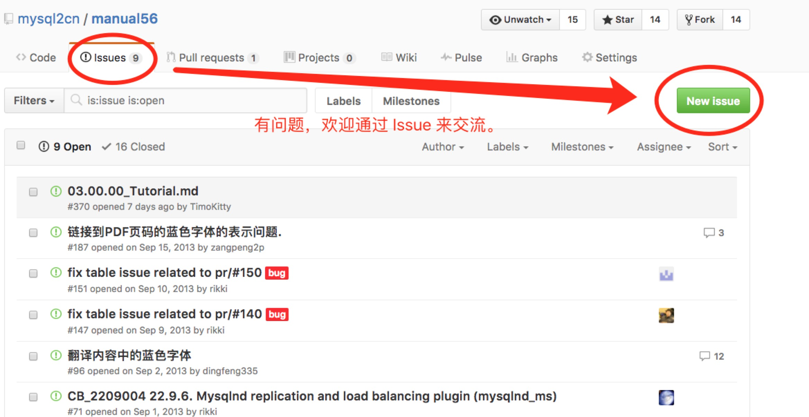
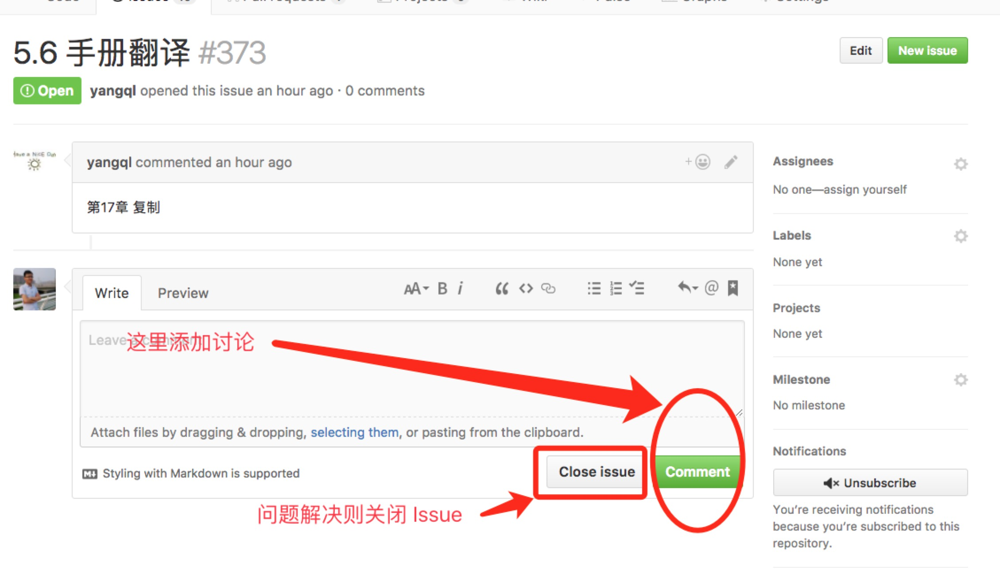

# MySQL 5.6 手册翻译重启声明

## 指定翻译文档

MySQL 官方文档更新还是挺频繁，我们必须选择一个版本来翻译。否则没法统一协调和分工。选择的版本如下：

[MySQL 5.6 Reference Manual 翻译专用版本](https://pan.baidu.com/s/1kViCbaR) -- **必须采用本文件作为翻译基础。**

MD5 (refman-5.6-en.a4.pdf) = fd9efdf9129239b0bd5e891570f25241

> 这是官方最新的 5.6 手册，请大家注意使用统一版本。

## 工具集

为了方便大家使用，把整理好的一些可能用到的工具集也分享一下： [Markdown 和 Git 相关的工具集](https://pan.baidu.com/s/1eRFFW9k)。

## 时间进度

* **准备阶段：** 2016年12月18日-2016年1月23日
* **翻译阶段：** 2016年12月24日起
* **审核阶段：** 2016年12月24日起
* **第二阶段：** 2017年1月－2018年1月 完成所有初稿
* **校对，润色：** 2018年1月-2018年3月 校对润色,统一语言风格.

## 问题与交流

在 Github 上开源的项目中，绝大部分是使用 Issue 来进行交流和沟通。这样问题的解答可以保留下来，问题相关的讨论都集中在一起，方便后续查找，也可以避免同样的问题，反复解答。

**强烈建议大家使用 Issue 来进行沟通和交流。**

**强烈建议大家使用 Issue 来进行沟通和交流。**

**强烈建议大家使用 Issue 来进行沟通和交流。**

使用方式如下：

### 创建 Issue

### 在 Issue 中参与讨论

## 参考资料
* **专业术语词汇表**
 1. [专业术语词汇表](./docs/glossary.md)

* **翻译模板**
 1. [翻译模板](./Template.md)

* **MySQL 文档**
 1. [MySQL 5.6 Reference Manual 翻译专用版本](https://pan.baidu.com/s/1kViCbaR) -- **必须采用本文件作为翻译基础。**
 MD5 (refman-5.6-en.a4.pdf) = fd9efdf9129239b0bd5e891570f25241
 2. [MySQL 5.6 Reference Manual](http://dev.mysql.com/doc/refman/5.6/en/index.html)——没错，这就是要翻译的文档(在线版本).变动较为频繁请不要基于此做翻译.

* **Markdown格式说明**
 1. [Markdown 快速入门](http://wowubuntu.com/markdown/basic.html)
 2. [Markdown 语法说明](http://wowubuntu.com/markdown/index.html)——这里有Markdown编辑器介绍。选一个自己趁手的工具就行。
 3. [轻量级标记语言](http://www.worldhello.net/gotgithub/appendix/markups.html)——我们需要使用一些Github扩展过的Markdown格式，比如表格，这个文档有详细介绍。
 4. [超链接和锚点在Markdown中的处理：视频+文档](http://www.diguage.com/archives/64.html)
 1. [GFM(Github 风格的MD)参考](https://help.github.com/articles/github-flavored-markdown#references)--我们使用的MD版本

* **Git & Github**
 1. [GotGitHub](http://www.worldhello.net/gotgithub/)
 2. [Githug通关全攻略](http://fancyoung.com/blog/githug-cheat-sheet/)
 3. [Git&Github社区化协作使用指南](http://www.diguage.com/archives/42.html)--D瓜哥录制的视频加文字说明，建议从这个教程看起。

## 其他
* 关于科学上网相关的事情,请私下联系@rikki解决.
