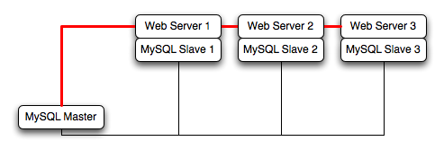

### 15.4.3. 使用EC2来部署MySQL数据库

因为你无法保证EC2实例的正常运行时间和可用性，在EC2环境中部署MySQL时，选择一个可以在所有EC2实例之间简便地分派工作的方式。有很多种方法可以实现这个目标。分片技术是其中的一个有效方法：你可以将应用程序切分到多个服务器上，并在不同的服务器上存储特定的数据集和用户数据。一个大原则是，创建多个EC2实例来支持更多用户比升级到更大的实例更为简便。

EC2架构的最好用法是将EC2实例作为暂时的、基于缓存的解决方案，而不是长期的、高可用的解决方案。除了利用多个实例外，也可以利用其它服务，比如**memcached**来为应用程序提供额外的缓存，以便减轻MySQL服务器的负载，从而使其可以更专注于写性能。在大型和极大型实例上，可用的内存可以提供大量的空间用于缓存数据。

在自己的服务器上使用的向外扩展的拓扑多数都可以应用到EC2环境中。但是要参考前面提到的局限性和建议来确保任何可能的故障都不会导致数据丢失。此外，因为单个EC2实例的相对性能不高，要做好修改应用程序以支持分片，并添加更多的EC2实例来提高应用程序性能。

例如在下图所示的典型向外扩展环境中，一个主库复制到多个从库中（这个例子中有三个从库），然后每个从库连接到一个网络服务器。

你可以完全利用EC2环境来实现这个架构：用一个EC2实例来作为主库，然后为每个网络服务器和MySQL从库服务器创建一个实例。

> 注意

> 在EC2环境中，EC2实例使用的内部（私有）IP地址是不变的。实例间通讯时一定要使用内部IP地址。仅在与外界通讯时 - 比如公开你的应用程序 - 才使用公有IP地址。

为了确保数据库的可靠性，可以将至少一个从库只用于备份，并将备份存储到亚马逊S3。参见下图的示例拓扑。

在EC2实例上***使用memcached***应该会提供更好的性能。大型和极大型实例拥有大量的可用内存。在你的应用程序中使用**memcached**时，每次从数据库中读取信息前，先检查其是否已在缓存中存在。如果你查找的数据已经存在于缓存中，那就直接使用它。不然再到数据库中提取数据并填充到缓存中。

***分片技术***将一台机器或者一个机器组用来存放将整个数据库分割以后某个特定组的独特数据。例如，你可以将所有以字母A-D结尾的姓氏的用户数据放在一个服务器上。当用户连接到应用程序，并且他们的姓氏是已知的，那么查询语句就可以被定向到相应的MySQL服务器上。

在EC2中使用分片技术时，将网络服务器和MySQL服务器分不到不同的EC2实例上，然后应用分片决策逻辑到你的应用程序中。在知道到哪个MySQL服务器访问数据后，你就可以将查询语句分发到相应的服务器上。请参见下图的示例。

> 警告

> 使用EC2和分片技术时，请注意单个实例的故障不会影响整个应用。如果运行MySQL服务器的单个分片EC2实例有故障，那么整个分片上的所有数据都是不可用的。