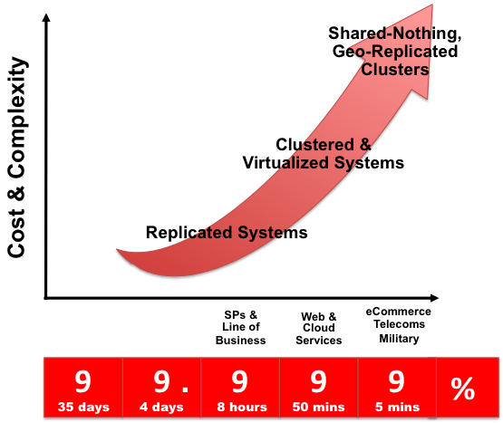

# 第15章 高可用性和高扩展性

#### [15.1 针对MySQL企业版的Oracle VM模板](./15.1_Oracle_VM_Template_for_MySQL_Enterprise_Edition.md)

#### [15.2. MySQL与DRBD/Pacemaker/Corosync/Oracle Linux概述](./15.2_Overview_of_MySQL_with_DRBD_Pacemaker_Corosync_Oracle_Linux.md)

#### [15.3. MySQL与Windows故障转移群集概述](./15.3_Overview_of_MySQL_with_Windows_Failover_Clustering.md)

#### [15.4. 在亚马逊EC2实例上使用MySQL](./15.4.0_Using_MySQL_within_an_Amazon_EC2_Instance.md)
* [15.4.1. 在EC2 AMI上设置MySQL](./15.4.1_Setting_Up_MySQL_on_an_EC2_AMI.md)
* [15.4.2. EC2实例的局限性](./15.4.2_EC2_Instance_Limitations.md)
* [15.4.3. 使用EC2来部署MySQL数据库](./15.4.3_Deploying_a_MySQL_Database_Using_EC2.md)

#### [15.5. 使用ZFS复制](./15.5.0_Using_ZFS_Replication.md)
* [15.5.1. 利用ZFS实现文件系统复制](./15.5.1_Using_ZFS_for_File_System_Replication.md)
* [15.5.2. 配置MySQL与ZFS](./15.5.2_Configuring_MySQL_for_ZFS_Replication.md)
* [15.5.3. 处理ZFS上的MySQL恢复](./15.5.3_Handling_MySQL_Recovery_with_ZFS.md)

#### [15.6. 使用MySQL与memcached](./15.6.0_Using_MySQL_with_memcached.md)
* [15.6.1. 安装memcached](./15.6.1_Installing_memcached.md)
* [15.6.2. 使用memcached](./15.6.2_Using_memcached.md)
* [15.6.3. 开发一个memcached应用](./15.6.3_Developing_a_memcached_Application.md)
* [15.6.4. 获取memcached统计数据](./15.6.4_Getting_memcached_Statistics.md)
* [15.6.5. memcached常见问题](./15.6.5_memcached_FAQ.md)

#### [15.7. MySQL Proxy](./15.7.0_MySQL_Proxy.md)
* [15.7.1. MySQL Proxy支持平台](./15.7.1_MySQL_Proxy_Supported_Platforms.md)
* [15.7.2. 安装MySQL Proxy](./15.7.2_Installing_MySQL_Proxy.md)
* [15.7.3. MySQL Proxy命令选项](./15.7.3_MySQL_Proxy_Command_Options.md)
* [15.7.4. MySQL Proxy脚本](./15.7.4_MySQL_Proxy_Scripting.md)
* [15.7.5. 使用MySQL Proxy](./15.7.5_Using_MySQL_Proxy.md)
* [15.7.6. MySQL Proxy常见问题](./15.7.6_MySQL_Proxy_FAQ.md)

数据是当今网络化，移动化，社交化，企业化以及云应用的流通货币。保证数据一直处于可用状态是每个企业和组织的首要任务。以分钟计算的宕机时间都有可能会导致严重的收入和声誉损失。

以“一刀切”来提供高可用性（HA）的方式是不存在的。独特的应用程序属性、业务需求、运维能力和已存在的基础设施都会影响HA技术的选择。技术只是提供HA方案中的一个元素：人员与流程和技术本身一样重要。

部署MySQL的很多应用程序都要求可用性和扩展性。**可用性**是指应对故障并且在需要的情况下从故障中恢复的能力。可能的故障包括MySQL故障、操作系统故障、或者硬件故障以及维护等其他可能造成宕机的行为。[**扩展性**](http://dev.mysql.com/doc/refman/5.6/en/glossary.html#glos_scalability)是指将数据库和应用程序查询的负载均衡分布到多个MySQL服务器的能力。

因为每个应用对运营和可用性都有不同的需求，MySQL提供一系列认证和支持的解决方案，以提供适当级别的高可用性(HA)和扩展性，从而满足服务水平要求。这些解决方案扩展自MySQL复制，通过虚拟化和地理冗余，以及多数据中心方案来提供99.999%的正常运行时间。

为一个应用选择正确的高可用性解决方案很大程度上取决于以下因素：

* 需要的可用性级别
* 要部署的应用类型
* 内部环境可接受的最佳实践

MySQL支持的主要解决方案包括：

* MySQL复制。了解更多：[第16章，复制](http://dev.mysql.com/doc/refman/5.6/en/replication.html)
* MySQL Cluster。了解更多：[第17章，MySQL Cluster NDB 7.3](http://dev.mysql.com/doc/refman/5.6/en/mysql-cluster.html)
* 针对MySQL的Oracle VM模板。 了解更多：第15.1节，“[针对MySQL企业版的Oracle VM模板](./15.2_Overview_of_MySQL_with_DRBD_Pacemaker_Corosync_Oracle_Linux.md)”
* MySQL和DRBD以及Corosync和Pacemaker。了解更多：第15.2节, “[MySQL和DRBD/Pacemaker/Corosync/Oracle Linux概述](./15.2_Overview_of_MySQL_with_DRBD_Pacemaker_Corosync_Oracle_Linux.md)“
* MySQL与Windows故障转移集群。了解更多：第15.3节，”[MySQL与Windows故障转移群集概述](./15.3_Overview_of_MySQL_with_Windows_Failover_Clustering.md)“。
* MySQL与Solaris集群。[了解更多关于Solaris集群](http://www.oracle.com/technetwork/server-storage/solaris-cluster/overview/index.html)。

更多选择可以通过第三方解决方案来获得。

每个用来实现高可用性数据库服务的架构都因为提供的正常运行时间级别而不同。这些架构可以分为三个大的类别：

* 数据复制
* 集群与虚拟化系统
* 无共享、地理复制集群

如下图所示，每种架构都提供了更高级别的正常运行时间，而这必须与每种架构更高的成本和复杂性相权衡。仅仅部署一个高可用架构并不足以保证能够提供HA。事实上，实施和维护不良的无共享集群会比一个简单的数据复制方案更容易导致更低级别的可用性。

**图15.1 权衡：成本及复杂性与可用性**

下表比较了各种MySQL解决方案的HA和扩展性能力：

**表15.1. MySQL高可用解决方案功能特点对比**
<table summary="MySQLHA解决方案功能特点对比" border="1">
   <colgroup>
      <col>
      <col>
      <col>
      <col>
      <col>
   </colgroup>
   <thead>
      <tr>
         <th scope="col">需求</th>
         <th scope="col">MySQL 复制</th>
         <th scope="col">DRBD</th>
         <th scope="col">Oracle VM模板</th>
         <th scope="col">MySQL Cluster</th>
      </tr>
   </thead>
   <tbody>
      <tr>
         <td scope="row"><strong>可用性</strong></td>
         <td class="auto-generated"> </td>
         <td class="auto-generated"> </td>
         <td class="auto-generated"> </td>
         <td class="auto-generated"> </td>
      </tr>
      <tr>
         <td scope="row">平台支持</td>
         <td><a class="ulink" href="http://www.mysql.com/support/supportedplatforms/database.html" target="_top">MySQL服务器支持的所有平台</a>
         </td>
         <td>Linux</td>
         <td>Oracle Linux</td>
         <td><a class="ulink" href="http://www.mysql.com/support/supportedplatforms/cluster.html" target="_top">MySQL Cluster支持的所有平台</a>
         </td>
      </tr>
      <tr>
         <td scope="row">自动IP故障转移</td>
         <td>否</td>
         <td>是</td>
         <td>是</td>
         <td>取决于连接器和配置</td>
      </tr>
      <tr>
         <td scope="row">自动数据库故障转移</td>
         <td>否</td>
         <td>是</td>
         <td>是</td>
         <td>是</td>
      </tr>
      <tr>
         <td scope="row">自动数据重同步</td>
         <td>否</td>
         <td>是</td>
         <td>不适用 - 共享存储</td>
         <td>是</td>
      </tr>
      <tr>
         <td scope="row">一般故障转移时间</td>
         <td>取决于用户/脚本</td>
         <td>取决于配置，60秒或更长</td>
         <td>取决于配置，60秒或更长</td>
         <td>1秒或更短</td>
      </tr>
      <tr>
         <td scope="row">同步复制</td>
         <td>否，异步或半同步</td>
         <td>是</td>
         <td>不适用 - 共享存储</td>
         <td>是</td>
      </tr>
      <tr>
         <td scope="row">共享存储</td>
         <td>否，分布式</td>
         <td>否，分布式</td>
         <td>是</td>
         <td>否，分布式</td>
      </tr>
      <tr>
         <td scope="row">地理性冗余支持</td>
         <td>是</td>
         <td>是，通过MySQL复制</td>
         <td>是，通过MySQL复制</td>
         <td>是，通过MySQL复制</td>
      </tr>
      <tr>
         <td scope="row">在线更新Schema</td>
         <td>否</td>
         <td>否</td>
         <td>否</td>
         <td>是</td>
      </tr>
      <tr>
         <td scope="row"><strong>扩展性</strong></td>
         <td class="auto-generated"> </td>
         <td class="auto-generated"> </td>
         <td class="auto-generated"> </td>
         <td class="auto-generated"> </td>
      </tr>
      <tr>
         <td scope="row">节点数量</td>
         <td>一个主库，多个从库</td>
         <td>一个主动节点（primary），一个被动节点（secondary）</td>
         <td>一个主动节点（primary），一个被动节点（secondary）</td>
         <td>255</td>
      </tr>
      <tr>
         <td scope="row">内置负载均衡</td>
         <td>读操作，通过MySQL复制</td>
         <td>读操作，通过MySQL复制</td>
         <td>读操作，通过MySQL复制 &amp; 在故障转移时</td>
         <td>读写操作都支持</td>
      </tr>
      <tr>
         <td scope="row">支持读密集型工作负荷</td>
         <td>是</td>
         <td>是</td>
         <td>是</td>
         <td>是</td>
      </tr>
      <tr>
         <td scope="row">支持写密集型工作负荷</td>
         <td>是，通过应用程序层分片</td>
         <td>是，通过应用程序层分片实现多个主动/被动配对节点</td>
         <td>是，通过应用程序层分片实现多个主动/被动配对节点</td>
         <td>是，通过自动分片</td>
      </tr>
      <tr>
         <td scope="row">在线扩展（添加节点，重新分区等等）</td>
         <td>否</td>
         <td>否</td>
         <td>否</td>
         <td>是</td>
      </tr>
   </tbody>
</table>