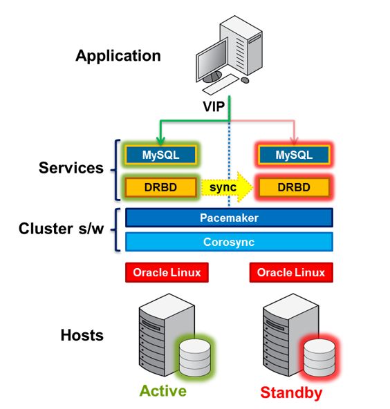

## 15.2 MySQL与DRBD/Pacemaker/Corosync/Oracle Linux概述

DRBD（分布式复制块设备）是提供MySQL HA（高可用性）的领先解决方案之一。结合Pacemaker和Corosync使用，用户可以获得:：

* 一套完整的由终端到终端的、可靠的开源技术方案，并由Oracle提供完整支持（作为MySQL企业版的一部分）。
* 自动故障转移和恢复以实现服务的持续性。
* 通过同步复制实现的镜像来确保在不丢失已提交事务的前提下实现故障转移。
* 由商用硬件构建的HA集群，无需共享存储。

下图显示了可以提供高可用性MySQL服务的架构。

这个架构的最底层需要两台主机来提供物理冗余；如果使用虚拟环境，那么这两个主机需要在运行在不同的物理机上。另外一点很重要的特点是，这个架构不需要共享存储。在任何时候MySQL都会在一台主机处于主动状态，而另外一台处于被动状态。

Pacemaker和Corosync相结合可以提供处于MySQL服务和底层主机及操作系统之间的集群层。Pacemaker负责启动和停止服务，确保他们只在一台主机上运行，从而保证高可用性并且避免数据毁损。而Corosync则提供了节点之间保证Packmaker可以正常工作的底层通讯架构；同时Corosync还要处理各个节点之间的关系，并在有任何变化的时候通知Pacemaker。

**图15.2. MySQL, DRBD, Pacemaker, 及Corosync架构**

核心Pacemaker进程本身不知道需要管理的特定服务的信息，而是针对具体服务使用封装好的代理。例如，在这个解决方案中，我们使用代理来管理虚拟IP地址，MySQL，以及DRBD：针对这些服务Packmaker本身包含了相应的代理。

在这个配置中，由Packmaker来管理的重要服务有DRBD，MySQL，以及应用程序用来连接到主动MySQL服务的虚拟IP地址。

DRBD在块设备层同步数据（通常是机械或者固态硬盘），而这些对于应用程序、数据库、甚至是文件系统来说都是透明的。DRBD要求必须使用支持日志的文件系统，比如ext3或者ext4。对于这个解决方案，DRBD工作于主动-被动模式：在任何时间点，只有一台主机对由DRBD管理的目录有读写权限，而另外一台主机没有任何权限（即便是读权限）。任何在主动主机上做的改动都会由DRBD同步复制到被动主机上。

关于安装、配置、部署和测试整个MySQL和DRBD架构的详细说明可以在下面文档中找到，其中包括：

* MySQL数据库
* DRBD核心模块和用户层工具
* Packmaker和Corosync集群消息和管理流程
* Oracle Linux操作系统

在这里下载文档：[http://www.mysql.com/why-mysql/white-papers/mysql-high-availability-drbd-configuration-deployment-guide/](http://www.mysql.com/why-mysql/white-papers/mysql-high-availability-drbd-configuration-deployment-guide/)

#### 对DRBD的支持

整个对于MySQL的DRBD架构都已经过Oracle认证，并且可以通过[MySQL企业版](http://www.mysql.com/products/enterprise/)和[Oracle Linux Premier支持](http://www.oracle.com/us/technologies/linux/support/overview/index.html)来获取商业支持，这使得关于操作系统、DRBD、集群软件或者MySQL本身的问题都可以通过整个单点联系来获取整个架构的支持。