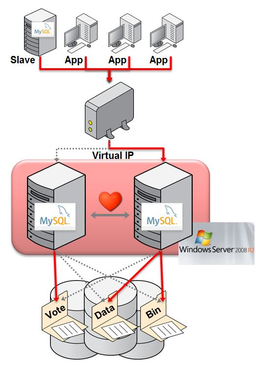

# 15.3 MySQL与Windows故障转移群集概述

## 15.3 MySQL与Windows故障转移群集概述

根据MySQL用户社区调查反馈，微软Windows一直被评为顶级的MySQL开发平台。

MySQL企业版通过了Windows Server 2008 R2故障转移群集（WSFC）的认证并获得支持，从而使得企业可以使用微软的原生Windows群集服务来安全地部署要求高可用性的关键业务应用程序。

下图显示了通过集成MySQL与Windows Server故障转移群集来提供高可用服务的方案：

**图15.3 典型MySQL与Windows Server故障转移群集的HA配置**

在这个架构中，MySQL被部署为主动/被动配置。MySQL本身或者底层服务器的故障都会被自动检测到，然后MySQL实例会在被动节点上重新启动。正在访问数据库的应用程序以及MySQL复制备库在MySQL恢复完成并开始接受连接后，都会被自动重新连接到拥有相同虚拟IP地址的一个新的MySQL进程。

MySQL的Windows故障转移群集需要至少两台服务器，以及共享存储（例如FC-AL SAN或者iSCSI磁盘）。

MySQL二进制文件和数据文件储存在共享存储上，Windows故障转移群集可以确保在任何时间都只有一个群集节点可以访问这些文件。

客户端通过一个虚拟IP地址连接到MySQL服务。故障转移时客户端会经历短暂的连接丢失，但除了需要处理在故障转移过程中失败的事务以外，客户端并不需要知道故障转移的发生。

关于配置MySQL与Windows Server故障转移群集的更多信息可以从这个白皮书中获得：[http://www.mysql.com/why-mysql/white-papers/mysql_wp_windows_failover_clustering.php](http://www.mysql.com/why-mysql/white-papers/mysql_wp_windows_failover_clustering.php)

关于Windows Server故障转移群集的背景及使用信息，可以从微软Technet找到：

* [故障转移群集](http://technet.microsoft.com/en-us/library/cc725923\(v=ws.10\).aspx)
* [Windows Server 2008 R2中得故障转移群集](http://technet.microsoft.com/en-us/library/ff182338\(v=ws.10\).aspx)