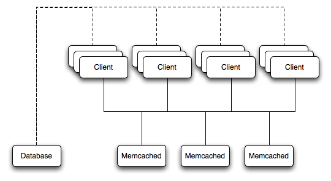

# 15.6. 使用MySQL与memcached

## 15.6. 使用MySQL与memcached

#### [15.6.1. 安装memcached](./15.6.1_Installing_memcached.md)
#### [15.6.2. 使用memcached](./15.6.2_Using_memcached.md)
#### [15.6.3. 开发一个memcached应用](./15.6.3_Developing_a_memcached_Application.md)
#### [15.6.4. 获取memcached统计数据](./15.6.4_Getting_memcached_Statistics.md)
#### [15.6.5. memcached常见问题](./15.6.5_memcached_FAQ.md)

**memcached** 是一个简单的、高扩展性的基于键的缓存，用于在有可用的专属或多余的内存时存放数据或者对象以便可以让应用程序快速访问，从而避免多层解析以及磁盘I/O。你可以在一台或多台主机上运行 **memcached** 命令来使用它，然后使用共享缓存来存储对象。更多的使用指南可以参见[第15.6.2节 使用 **memcached**](./15.6.2_Using_memcached.md)。

使用 **memcached** 的好处包括：

* 所有的信息都存储在内存中，所以访问速度要比每次从磁盘中读取信息快。

* 键-值对中的“值”部分没有任何数据类型的限制，因此你可以缓存例如复杂结构、文档、图片等，或者这些对象的混合。

* 如果你使用内存中缓存来存储瞬时信息，或者作为存放在数据库中信息的一个只读缓存，那么任何 **memcached** 服务器的故障都不严重。对于持久性数据，你可以回退到使用数据库查询的替代性查询方式，然后在不同的服务器上将数据加载到内存中。

典型的使用环境是修改你的应用程序以便信息从由 **memcached** 提供的缓存中读取。如果信息不在 **memcached** 中，则从MySQL数据库中读取数据并且写入到缓存中，以便接下来对相同对象的请求可以受益于缓存的数据。

典型的部署设计，参见 [图15.4，“memcached架构概述”]()

**图15.4. memcached架构概述**

在示例的结构中，任意的客户端都可以连接其中一台 **memcached** 服务器来请求一个键值。每个客户端的配置都可以和图中所示的所有服务器通讯。当客户端内发起存储信息的请求时，用来引用数据的键会被生成一个哈希值，这个哈希值用来选择其中一台 **memcached** 服务器。 **memcached** 服务器的选择发生在与服务器通讯之前，从而保证这个过程的轻量级。

当客户端请求一个键值时会使用同样的算法。同一个键产生同样的哈希值，同一台 **memcached** 服务器将被选中作为数据源。利用这个方法，缓存的数据被分不在所有的 **memcached** 服务器上，缓存的信息可以被任意客户端访问。这样做的结果就是一个分布式的、基于内存的缓存，这个缓存可以比在数据库中读取数据更为快捷地返回信息，尤其是复杂的数据和结构。

传统的 **memcached** 从不将数据存储在磁盘上（只在内存中，意味着数据不是持久的），而内存中的缓存总是由后端存储填充（MySQL服务器）。如果某台 **memcached** 服务器出了故障，数据总是可以从MySQL数据库中恢复。