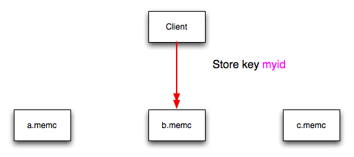
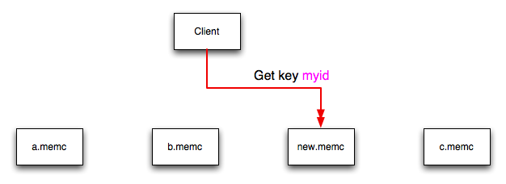
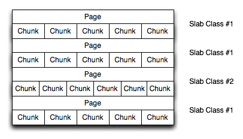

# 15.6.2. 使用memcached

### 15.6.2. 使用memcached

#### [15.6.2.1. memcached部署](#15.06.02.01)
#### [15.6.2.2. 使用命名空间](#15.06.02.02)
#### [15.6.2.3. 数据失效](#15.06.02.03)
#### [15.6.2.4. memcached 哈希/分布类型](#15.06.02.04)
#### [15.6.2.5. 使用 memcached 和 DTrace](#15.06.02.05)
#### [15.6.2.6. memcached 内存分配](#15.06.02.06)
#### [15.6.2.7. memcached 线程支持](#15.06.02.04)
#### [15.6.2.8. memcached 日志](#15.06.02.08)

在一台或多台服务器上启动 **memcached** 服务来开始使用 **memcached** 。运行 **memcached** 会设置服务器，分配内存，以及开始监听客户端发送来的连接。

> 注意

> 除非要监听特权TCP/IP端口（低于1024），运行 **memcached** 无需使用特权账号。但是你必须使用一个被通过 **setrlimit** 限制内存使用或类似限制的用户。

要启动服务器，使用一个非特权用户（也就是非root用户）来运行 **memcached** 命令：

```bash
shell> memcached
```

**memcahed** 默认使用以下设置：

* 内存分配为64MB

* 使用11211端口来监听所有的网络接口的连接

* 支持最多1024同时连接

一般情况下，你应该在启动 **memcached** 时指明所有你需要的选项的集合，并创建一个启动脚本来处理 **memcached** 的初始化。 例如，下面这个命令在启动 **memcached** 时指定最多1024mb的内存用于缓存，在IP地址192.168.0.110上监听端口11211，并在后台运行：

```bash
shell> memcached -d -m 1024 -p 11211 -l 192.168.0.110
```

为确保 **memcached** 在服务器启动时运行，检查初始化脚本和配置参数。

**memcached** 支持以下选项：

* -u 用户
  
    如果你以root身份启动 **memcached**， 使用-u选项来指定用来运行 **memcached** 的用户：
    
    ```
    shell> memcached -u memcache
    ```

* -m 内存

    设定分配给 **memcached** 用来存储对象的内存大小。默认为64MB。

    使用 -m 选项来指定要分配的内存大小（以MB计算）来增加要分配给缓存的内存数量。分配的内存越多，则可存储的数据越多，从而使缓存更有效。

    > 警告

    > 不要给缓存分配大于服务器可用内存的数量。如果你指定的数值太大，那么分配给 **memcached** 的一部分内存会使用交换空间，而不是物理内存。这可能会导致存储和提取缓存值时的延缓，因为数据被交换到了磁盘上，而不是直接存储在内存里。

    > 你可以通过 **vmstat** 命令来查看free栏中显示的空闲内存大小：

    > ```
      shell> vmstat
      kthr      memory            page            disk          faults      cpu
      r b w   swap  free  re  mf pi po fr de sr s1 s2 -- --   in   sy   cs us sy id
      0 0 0 5170504 3450392 2  7  2  0  0  0  4  0  0  0  0  296   54  199  0  0 100
      ```

    例如，要分配3GB的内存：

    ```
    shell> memcached -m 3072
    ```

    在使用PAE来方位4GB限制以上内存的32位 x86 系统上，你不能分配超过最大进程大小的内存。你可以通过运行多个 **memcached** 实例的方式来绕过这条限制，每个实例将监听不同的端口：

    ```
    shell> memcached -m 1024 -p11211
    shell> memcached -m 1024 -p11212
    shell> memcached -m 1024 -p11213
    ```

    > 注意

    > 在所有系统上，尤其是32位系统上，要确保在分配给 **memcached** 的内存以外保留了足够的空余内存。例如，在有4GB可用内存的专属 **memcached** 主机上，不要将 **memcached** 内存设置为大于3500MB。不然可能会导致系统崩溃或者严重的性能问题。

* -l 接口

    指定一个监听连接的网络接口/地址。默认是监听所有可用地址（INADDR_ANY）。

    ```
    shell> memcached -l 192.168.0.110
    ```

    **memcached** 1.2.5添加了对 IPv6 地址的支持。

* -p 端口

    指定用于连接的TCP端口。默认是18080.
    
    ```
    shell> memcached -p 18080
    ```

* -U 端口

    指定用于连接的UDP端口。默认为11211，设置为0则关闭UDP。

    ```
    shell> memcached -U 18080
    ```

* -s 套接字

    指定要监听的Unix套接字。

    如果你在同一台主机上运行 **memcached** 和客户端，则可以禁用网络接口，并利用 -s 选项来使用本地Unix套接字：

    ```
    shell> memcached -s /tmp/memcached
    ```

    使用Unix套接字会自动禁用网络支持，并节省网络端口（从而可以将更多的端口用于网络服务器和其他进程）。

* -a 掩码

    以八进制格式指定用于Unix套接字的访问掩码。默认为0700。

* -c 连接数

    指定 **memcached** 服务支持的最大同时连接数。默认为1024。

    ```
    shell> memcached -c 2048
    ```

    使用这个选项来减少连接数（避免 **memcached** 服务过载），或增加连接数来更有效利用运行 **memcached** 服务的服务器。

* -t 线程数

    指定处理访问请求的线程数量。

    **memcached** 默认配置为使用4个同时运行的线程。线程可以提高在缓存中存储和读取数据的性能，并使用一个锁机制来避免不同的线程重写或更新同一个键值。要增加或减少线程数量，使用 -t 选项：

    ```
    shell> memcached -t 8
    ```

* -d
    
    将 **memcached** 作为守护（后台）进程：

    ```
    shell> memcached -d
    ```

* -r

    最大化Core文件的大小限制。遇到故障时，这个选项会尝试将全部内存空间转储到磁盘上一个Core文件中，大小受 **setrlimit** 限制。

* -M

    内存用尽时向客户端返回一个错误。这个选项会将默认从缓存中删除旧的条目以存储新条目的行为替换。

* -k

    锁住所有分页的内存。这会在需要使用之前预留内存，而不是在向缓存中写入新条目时分配新内存。

    > 注意

    > 这是用户级别的可以锁住的内存。分配多余可用内存的试图会失败。你可以使用 **ulimit -S -l NUM_KB** shell内为你启动守护进程的用户添加限制。

* -v

    冗长模式。在执行主循环是打印错误和警告。

* -vv

    非常冗长模式。除 -v 打印的信息外，还打印每一个客户命令及回复。

* -vvv

    极其冗长模式。除 -vv 打印的信息外，哈hi显示内部状态转换信息。

* -h

    打印帮助信息并退出。

* -i

    打印 **memcached** 和 libevent 许可信息。

* -I 内存数量

    指定 **memcached** 实例内存储对象的最大值。这个大小可以使用一个单位后缀（k代表千字节，m代表兆字节）。例如，将最大支持对象大小提高到32MB：

    ```bash
    shell> memcached -I 32m
    ```

    可指定的最大对象大小为128MB，默认为1MB。

    这个选项在 **memcached** 1.4.2中加入。

* -b

    设置积压队列限制。积压队列限制有多少个网络连接可以处于等待被 **memcached** 处理状态。增大这个限制可以减少客户端无法连接到 **memcached** 实例的错误数量，但无法提升服务器的性能。默认值为1024。

* -P pidfile

    将 **memcached** 实例的进程ID保存到文件中。

* -f

    设置chunk大小增长因子。在分配新的内存chunk时，分配的新chunk大小由默认slab大小和这个因子的乘积决定。

    使用 -vv 命令行选项来查看计算出的slab大小，以便在不需要大量测试的情况下查看设置这个选项的影响。更多信息，参见[第15.6.2.8节，“ **memcached** 日志”]()。

* -n 字节数

    为键+值+信号信息存储分配的最小空间。默认为48字节。

* -L 

    在支持大内存页的系统上，开启大内存页。使用大内存页可以使 **memcached** 使用一个大的chunk来分配条目缓存，从而通过减少访问内存时的错过的次数来提升性能。

* -C

    禁用比较并交换（CAS）操作。

* -D 字符

    设置用于作为键前缀和ID之间间隔符的默认字符。这个用于每个前缀统计报告[参见第15.6.4节，“获取 **memcached** 统计”]()。默认是冒号（：）。如果使用这个选项，则统计收集自动开启。如果未使用此选项，可以通过向服务器发送 `stat detail on`命令来开启统计收集。

    这个选项在 **memcached** 1.3.x中加入。

* -R 数量

    设置每个事件进程可发送请求的上限。默认为20。

* -B 协议

    设置约束协议，也就是 **memcached** 默认支持的客户端连接协议。可设置的值包括 `ascii`，`binary` 或者 `auto`。自动（`auto`）是默认设置。

    这个选项在 **memcache** 1.4.0加入。


#### <a id="15.06.02.01">15.6.2.1. memcached部署</a> ####

使用 **memcached** 时你可以使用多种不同的潜在部署策略和拓扑。确切的策略依具体的应用程序和环境而定。在系统内设计部署 **memcached** 的系统时，记住以下几点：

* **memcached** 只是一个缓存策略。它不应该用来存储不能丢失及在丢失后可以从另外的系统加载来的信息。

* **memcached** 协议没有内在的安全控制。所以只要要保证运行 **memcached** 的服务器仅在内网可以访问，并且使用的网络端口是被封锁的（使用防火墙或类似设置）。如果在 **memcached** 服务器存储敏感信息，则在存储到 **memcached** 之前将信息加密。

* **memcached** 不提供任何故障转移功能。因为在不同的 **memcached** 实例间没有任何通讯。如果一个实例出故障，那么应用程序必须可以将其从服务器列表中移除，并将数据重载和写入到另外一台 **memcached** 实例。

* 如果客户端和 **memcached** 使用不同的物理服务器，那么他们之间的通讯延迟可能会是一个问题。如果延迟造成问题，将 **memcached** 迁移到客户端主机上。

* 键的长度由 **memcached** 服务器决定。默认最大键长时250字节。

* 尝试使用至少两台 **memcached** 实例，尤其在为多个客户端服务时，以避免单点故障。理想情况下，创建尽可能多的 **memcached** 节点。在向存储池添加和移除 **memcached** 实例时，哈希值和键值分布可能会受影响。关于如果避免这个问题的更多信息，参见[第15.6.2.4节，“ **memcached** 哈希/分布类型“]()。


#### <a id="15.06.02.02">15.6.2.2. 使用命名空间</a> ####

**memcached** 是一个简单的大型键值存储系统，因此不提供自动将数据分类到不同区域的机制。例如，如果从MySQL数据库中返回的数据以唯一ID的形式存储，那么存储在两个不同表格中的数据可能会因为ID冲突而造成问题。

一些接口在向缓存储存信息时提供一个自动创建 _命名空间_ 的机制。在实践上，这些命名空间只是每次在向缓存写入和读取数据时，给每个ID加的一个前缀。

你可以这样来实现这个简单原则：在向缓存写入数据时，给键名加上一个唯一标示符作为前缀。例如，在存储用户数据时，给每个ID加上 `user:`或`user-`。

> 注意

> 使用命名空间或前缀之呢过控制存储和读取的键。**memcached** 本身没有安全机制，因此没有办法保证每个客户端都只能访问命名空间内的键。命名空间只在标识数据和避免键值对冲突时有用。


#### <a id="15.06.02.03">15.6.2.3. 数据失效</a> ####

**memcached** 有两种数据失效方式。第一种是在向 **memcached** 实例存储一个新的键值对时应用。如果缓存中没有足够的空间来存储新的键值，那么一个已存在的最少最近使用（LRU）对象会被从缓存中删除（弹出）从而为新条目让出空间。

LRU算法确保被删除的对象是不再需要使用的，或是在很长时间以前使用过以至于数据已经过期或者只有很小的价值。但是，在分配给 **memcached** 的内存小于需要存储在缓存中的对象数量的系统中，即使很多条目依然在被使用，他们仍可能被从缓存中删除。统计机制可以更好地显示弹出的级别（过期对象）。更多信息参见[第15.6.4节，“获取 **memcached** 统计信息”]()。

可以在启动 **memcached** 时使用 -M 命令行选项来改变默认弹出行为。这个选项会在内存用尽时强制返回一个错误信息，而不是自动弹出旧数据。

第二种过期方式是在将键值对写入到缓存时或从缓存中删除条目时显式设置的机制。使用过期时间是确保缓存中数据保持更新以及符合应用程序需要和需求的有效方式。

一个典型的应用场景是在用户访问一个网站时，显式设置包含缓存会话数据的过期时间。**memcached** 使用懒散过期机制，也就是请求对象时会将当前时间与已经设置好的过期时间相比较。只有尚未过期的对象会被返回。

你也可以在从缓存中显式删除一个对象时设置过期时间。在这里，过期时间只是一个超时设置，用来表明任何设置一个键值的尝试被拒绝的时间段。

#### <a id="15.06.02.04">15.6.2.4. memcached 哈希/分布类型</a> ####

**memcached** 客户端接口支持多种不同的分布算法，用来在多服务器配置中决定用哪一台 **memcached** 实例来存储和读取数据。在读取或存储数据时，一个由提供的键生成的哈希值会被用来在列表中配置的服务器中选择一台主机。因为这个哈希算法以提供的键作为哈希值的基础，所以在读取和存储操作中，针对同一个键会选择同一台主机。

这个过程如下所描述：在一组服务器中（a，b，和c），客户端使用哈希算法基于要存储或读取的键得到一个整数值。这个整数值用来在客户端配置的服务器组中选取一台主机。大多数 **memcache** 客户端在计算哈希时使用一个简单的针对配置的服务器数量值的模计算方法。这个过程可以用下面的伪代码概述：

```
@memcservers = ['a.memc','b.memc','c.memc'];
$value = hash($key);
$chosen = $value % length(@memcservers);
```

用实际值提单上面的伪代码：

```
@memcservers = ['a.memc','b.memc','c.memc'];
$value = hash('myid');
$chosen = 7009 % 3;
```

在上面的例子中，客户端哈希算法选择索引为1的服务器（7009 % 3 = 1)，然后在这台服务器上存储和读取该键值。

> 注意

> 这里的选择和哈希过程是由 **mecached** 客户端自动处理的；你需要提供一组 **memcached** 服务器来使用。

关于这个过程的图形化描述，参见图15.5， “ **memcached** 哈希选择”。

**图15.5. memcached 哈希选择**



同样的哈希和选择过程会被 **memcached** 客户端用于所有的针对指定键的操作。

这个哈希和选择方法有以下一些好处：

* 哈希和服务器的选择过程是完全在客户端处理的。这消除了通过网络通讯来决定正确主机的需要。

* 因为 **memcached** 的选择完全发生在客户端，无论要进行的操作是什么（设置，获取，增量，及其它），服务器都可以自动被选择。

* 因为服务器的确定在客户端处理，哈希算法针对一个键返回同样的值；数据值不会因服务器环境不同而受影响或者重置。

* 选择过程非常快。基于键值的哈希算法非常快，而最终服务器的选择仅是从一个简单的可以服务器数组中做出。

* 使用客户端哈希简化了数据在每个 **memcached** 服务器上的分布过程。由哈希算法返回的键值自然分布意味着键被自动分布到所有可用的服务器上。

只要在客户端配置的服务器列表保持一致，因为同样的存储键返回同样的值，所以会选择同一台服务器。

但是，如果你不使用同样的哈希算法，则同样的数据会被不同的接口在不同的服务器上储存，不但会在 **memcached** 上浪费空间，还会带来潜在的信息不一致。

> 注意

> 使用多接口匹配的哈希算法的一个方式是使用 **libmemcached** 库及其相关接口。因为针对不同语言（包括C，Ruby，Perl和Python）的接口使用同样的客户端库接口，所以他们总是针对同样的ID生成同样的哈希码。

在客户端做服务器选择的问题是，服务器列表（包括他们在列表中的次序）都必须在每个使用 **memcached** 服务器的客户端保持一致，并且服务器必须可用。

如果在以下情况下执行对一个键的操作：

* 加入一个新的 **memcached** 到可用实例列表中

* 从可用实例列表中移除一个 **memcached** 实例

* 改变 **memcached** 实例的次序

在不同的服务器列表上对一个键执行哈希算法时，哈希计算可能会在列表中选择一台不同的服务器。

如果一台新的 **memcached** 实例被添加到服务器列表中，例如下图中的 **new.memc**，那么针对同一个键myid的GET操作可能会导致无法命中缓存。这是因为同样的键计算出同样的值，然后在服务器数组中选择同样的索引，但是索引2现在指向一台新的服务器，而不是数据本来存储在的 **c.memc** 服务器上。这会导致缓存无法命中，几遍这个键值在另一台 **memcached** 实例的缓存中存在。

**图15.6. 加入新 memcached 实例后 memcached 的哈希选择**



这意味着服务器 **c.memc** 和 **new.memc** 都包含键 **myid** 的信息，但这个键的信息在两个实例上可能是不同的。更严重的问题是在读取数据时更大数量的缓存无法命中，因为新的服务器改变了键的分布，从而要求重组 **memcached** 实例中的缓存数据，今儿导致对数据库更多的读取。

客户端配置好的服务器列表中每个实例都是标记为可用的，因此向列表中添加或删除配置好的 **memcached** 实例等主动对服务器列表做的改变都会产生同样的影响。例如，在删除一台 **memcached** 实例后，当客户端意识到该服务器已无法连接时就会导致服务器选择失败。

你可以通过选择用来选择服务器的算法来避免这个现象造成重大问题或使缓存失效。有两种常用的哈希算法， _consistent_ 和 _modula_ 。

使用 _consistent_ 算法时，针对一组服务器，同一个建总是会在同一台服务器上存储和读取键值，即便配置的服务器列表发生了改变。这意味着你可以向配置好的列表中添加或者删除服务器，但依然在同一服务器上使用同一键值。有两种一致性哈希算法，Ketama和Wheel。两种算法 **libmemcached** 都支持，并且有可用的PHP和Java实现。

任何一致性哈希算法都有局限性。当向已存在的配置好的服务器组中添加服务器时，作为正常分布的一部分，键值会被分布到新服务器上。当从服务器组中移除服务器时，键值又会被重新分配到列表中其他的服务器上，也就是说信息需要被重新加载到缓存中。并且，一致性哈希算法无法解决在多个客户端之间使用一致服务器选择的问题，而是每个客户端都会有不同的服务器列表。这里的一致性只在同一客户端是强制实现的。

使用 _modula_ 算法，客户端会首先计算出哈希，然后在一组配置好的服务器中选择一个。列表中服务器发生改变时，使用modula哈希算法选择的服务器也会改变。结果就是前面描述的行为；服务器列表的改变意味着在读取数据时选择的服务器不同，从而导致缓存无法命中，以及重新从数据库中加载信息的负载增加。

如果针对每个客户端仅使用一台 **memcached** 实例，或者对一个客户端配置的 **memcached** 服务器列表不会变化，那么哈希算法的选择是无关紧要的，因为这不会有明显的影响。

如果经常更改服务器，或者在大量客户端之间共享一组服务器，那么使用一致性哈希算法可以帮助确保缓存的数据不会重叠，并且数据是均匀分布的。

#### <a id="15.06.02.05">15.6.2.5. 使用 memcached 和DTrace</a> ####

**memcached** 包含了可以用来监测服务器运行的不同的探测器。这些探测器可以用来监测个体连接，slab分配，以及在键值对被添加、更新、或者删除时对哈希表的改变。

关于DTrace和编写DTrace脚本的更多信息，参见[DTrace用户指南](http://docs.oracle.com/cd/E19253-01/819-5488/)。

**memcached** 从版本1.2.6 开始添加了对DTrace探测器的支持，以帮助监测应用程序。Solaris 10， OpenSolaris， Mac OS X 10.5，和 FreeBSD支持DTrace。要在 **memcached** 中开启DTrace探测器，需要从源代码编译并使用 **--enable-dtrace** 选项。更多信息参见[第15.6.1节，“安装 **memcached** ”](./15.6.1_Installing_memcached.md)。

**memcached** 支持的探测器包括：

* conn-allocate(connid)

    在连接池分配一个连接对象时触发。

    * connid： 连接ID。

* conn-release(connid)

    在连接对象被释放并归还到连接池时触发。

    参数：

    * connid：连接ID。

* conn-create(ptr)

    在一个新的连接对象创建时触发（也就是指连接池中没有可用的连接对象时）。

    参数：

    * ptr：指向连接对象的指针。

* conn-destroy(ptr)

    在连接对象被销毁时触发。

    参数：

    * ptr：指向连接对象的指针。

* conn-dispatch(connid, threadid)

    在一个连接被从主线程或连接管理线程分发到工作线程时触发。

    参数：

    * connid： 连接ID。

    * threadid： 线程ID。

* slabs-allocate(size, slabclass, slabsize, ptr)

    从slab分配器中分配内存。

    参数：

    * size：请求的大小。

    * slabclass：分发由此class完成。

    * slabsize：此class中每个条目的大小。

    * ptr：指向分配内存的指针。

* slabs-allocate-failed(size, slabclass)

    分配内存失败（内存用尽）。

    参数：

    * size： 请求的大小。

    * slabclass：完成分配的class。

* slabs-slabclass-allocate(slabclass)

    在一个slab class需要更多空间时触发。

    参数：

    * slabclass：需要更多内存的class。

* slabs-slabclass-allocate-failed(slabclass)

    分配内存失败（内存用尽）。

    参数：

    * slabclass：请求更多内存失败的class。

* slabs-free(size, slabclass, ptr)

    释放内存。

    参数：

    * size：要释放的内存数量，以字节为单位。

    * slabclass：要释放的内存所归属的class。

    * ptr：指向要释放的内存的指针。

* assoc-find(key, depth)

    在哈希表中搜索一个命名的健时触发。这两个元素可以体现哈希函数工作的效率。遍历是无法达到最佳性能的标志，意味着浪费CPU资源。

    参数：

    * key： 要查找的键。

    * depth：哈希表的深度。

* assoc-insert(key, nokeys)

    在新增条目时触发。

    参数：

    * key：刚插入的键。

    * nokeys：当前存储的键的数量，包括刚插入的键。

* assoc-delete(key, nokeys)

    在删除条目时触发。

    参数：

    * key：刚被删除的键。

    * nokeys：当前存储的键的数量，不包括刚被删除的键。

* item-link(key, size)

    在缓存中的一个条目被链接时触发。

    参数：

    * key：条目键。

    * size：数据的大小。

* item-unlink(key, size)

    在一个条目的链接被删除时触发。

    参数：

    * key：条目键。

    * size：数据的大小。

* item-remove(key, size)

    在一个条目的refcount被减小时触发。

    参数：

    * key：条目键。

    * size：数据的大小。

* item-update(key, size)

    在“最近访问”时间被更新时触发。

    参数：

    * key：条目键。

    * size：数据的大小。

* item-replace(oldkey, oldsize, newkey, newsize)

    在一个条目被另外一个条目替换时触发。

    参数：

    * oldkey：要被替换的条目的键。

    * oldsize：旧条目的大小。

    * newkey：新条目的键。

    * newsize：新条目的大小。

* process-command-start(connid, request, size)

    在一个命令开始处理时触发。

    参数：

    * connid：连接ID。

    * request：提交的请求。

    * size：请求的大小。

* process-command-end(connid, response, size)

    在一个命令处理结束时触发。

    参数：

    * connid：连接ID。

    * response：发送回给客户端的返回。

    * size：返回的大小。

* command-get(connid, key, size)

    由get命令触发。

    参数：

    * connid：连接ID。

    * key：请求的键。

    * size：键值的大小（如果没有该值则为-1）。

* command-gets(connid, key, size, casid)
  
    由gets命令触发。

    参数：

    * connid：连接ID。

    * key：请求的键。

    * size：键值的大小（如果没有该值则为-1）。

    * casid：条目的casid。

* command-add(connid, key, size)

    由add命令触发。

    参数：

    * connid：连接ID。

    * key：请求的键。

    * size：键值的大小（如果没有该值则为-1）。

* command-set(connid, key, size)

    由set命令触发。

    参数：

    * connid：连接ID。

    * key：请求的键。

    * size：新键值的大小（如果没有该值则为-1）。

* command-replace(connid, key, size)

    由replace命令触发。

    参数：

    * connid：连接ID。

    * key：请求的键。

    * size：新键值的大小（如果没有该值则为-1）。

* command-prepend(connid, key, size)

    由prepend命令触发。

    参数：

    * connid：连接ID。

    * key：请求的键。

    * size：新键值的大小（如果没有该值则为-1）。

* command-append(connid, key, size)

    由append命令触发。

    参数：

    * connid：连接ID。

    * key：请求的键。

    * size：新键值的大小（如果没有该值则为-1）。

* command-cas(connid, key, size, casid)

    由cas命令触发。

    参数：

    * connid：连接ID。

    * key：请求的键。

    * size：键值的大小（如果没有该值则为-1）。

    * casid： 请求的cas ID。

* command-incr(connid, key, val)

    由incr命令触发。

    参数：

    * connid：连接ID。

    * key：请求的键。

    * val：新的键值。

* command-decr(connid, key, val)

    由decr命令触发。

    参数：

    * connid：连接ID。

    * key：请求的键。

    * val：新的键值。

* command-delete(connid, key, exptime)

    由delete命令触发。

    参数：

    * connid：连接ID。

    * key：请求的键。

    * exptime：过期时间。

#### <a id="15.06.02.06">15.6.2.6. memcached 内存分配</a> ####

在 **memcached** 启动时，配置好的内存并不是自动分配。**memcached** 仅在开始向缓存中存储信息时才开始分配和预留物理内存。

向缓存中存储数据时，**memcached** 不以条目为单位来为数据分配内存，而是使用slab 分配以便优化内存使用，以及在缓存中信息失效时避免内存碎片。

slab分配内存时以1MB的内存块为单位。slab被分成同样大小的多个块。向缓存中存储一个值时， **memcached** 会检查这个值的大小，然后决定哪一个slab分配的大小适合这个值。如果这个大小的slab已经存在，那么这个值被写入到这个slab中的块里。

如果新值的大小比已存在的任何块都要大，则要创建一个新的slab，并分割成合适大小的块。如果具有合适的块大小的slab已经存在，但是已经没有可用的块，也要创建一个新的slab。如果将已存在的一个条目更新为比现有分配给该块内存大的条目，那么这个键要被重新分配到一个合适的slab。

例如，最小的块默认大小为88字节（40字节的值，以及默认48字节存放键和标识数据）。如果要存入缓存的第一个条目小于40字节，则创建一个块大小为88自己的slab并将值存入。

如果要存储的数据大于这个值，则块大小会根据chunk大小因子增加，知道块大小足够存储要存入的值。块的大小始终是一个比例因子的函数，并向上舍入到恰好可以被chunk大小整除。

这个结构的例子，参见图15.7， “**memcached** 内存分配”。

**图15.7. memcached 内存分配**



结果是在分配给 **memcached** 的内存区间内会分配很多页。每个内存页大小为1MB（默认），并被根据要存储的键值对大小分割为不同数目的chunk。每个实例会分配很多个页，在一个新的条目需要一个特定大小的chunk时，总是会创建一个新页。一个slab会包含很多页，在slab内的每个页都含有相同数目的chunk。

新slab的chunk大小是由基准chunk大小以及chunk大小增长因子结合决定。例如，如果初始chunk大小为104字节，而默认chunk大小增长因子为默认（1.25），那么下一个要创建的chunk大小为104*1.25 的best power of 2 fit，或者136字节。

以这种方式分配页保证了内存不会产生碎片。但是，根据要存储的对象分布，在存储大小极其不同的条目时，这可能会导致效率低下的slab和chunk分布。例如，在每个chunk内存储相对较少数目的条目可能会因为在每个分配的页里只有少数chunk而导致内存的浪费。

命令行选项中的 **-f** 可以用来优化增长因子来减轻这个影响，以适应增长因子从而有效地使用分配的chunk和slab。关于获取当前slab分配统计的更多信息，参见[15.6.4.2节，“**memcached** Slab统计“]()。

如果操作系统支持，还可以在启动 **memcached** 时使用 **-L** 选项。这个选项会在启动时使用大内存页预先分配所有的内存。这可以通过减少CPU缓存无法命中的次数来提升性能。

#### <a id="15.06.02.07">15.6.2.7. **memcached** 线程支持</a> ####

如果在从源码编译 **memcached** 时启用了线程实现，那么在 **libevent** 系统之外， **memcached** 还会使用多线程来处理请求。

线程实现启动时，用下面的方式运行：

* 线程由代码内的包装函数来处理，以提供防止在同一时间更新全局结构的基本保护。

* 每个线程使用自己的 **libevent** 实例来提升性能。

* TCP/IP连接由在TCP/IP套接字监听的单一线程来处理。每个连接都被以简单的循环方式分布到其中一个活动的线程上。然后每个连接会在连接保持开启的时候只在该线程内工作。

* 对于UDP连接，所有的线程都会在同一个UDP套接字监听进来的请求。当前正在处理其他请求的线程会忽略进来的包。剩下的没有处在忙碌状态的线程中的一个会处理这个请求并发送返回。这种实现可能会在线程从睡眠中苏醒进而处理请求时导致增加的CPU负载。

在拥有多个CPU内核的服务器上使用线程可以提升性能，因为更新哈希表的请求可以被分布到不同的线程中。为了最小化使用的锁机制带来的性能开销，根据工作负载内请求的数量和类型试验不同的线程数量来达到最佳性能。

#### <a id="15.06.02.08">15.6.2.8. memcached 日志</a> ####

如果使用`-v`，`-vv`，或者`-vvv`选项来开启冗长模式，则 **memcached** 输出的信息会包含执行的操作细节。

不使用冗长选项时， **memcached** 一般在正常运行时不会有输出。

* 使用`-v`输出

    最低级别的冗长模式会显示：

    * 错误和警告

    * 短错误

    * 协议与套接字错误，包括用尽可用的连接

    * 每个注册的客户端连接，包括套接字描述符号码和使用的协议

        例如：

        ```
        32: Client using the ascii protocol
        33: Client using the ascii protocol
        ```

        注意套接字描述符只在客户端保持连接时有效。非持久性连接可能不会被有效地显示。

    此级别输出的错误信息的列子包括：

    ```
    <%d send buffer was %d, now %d
    Can't listen for events on fd %d
    Can't read from libevent pipe
    Catastrophic: event fd doesn't match conn fd!
    Couldn't build response
    Couldn't realloc input buffer
    Couldn't update event
    Failed to build UDP headers
    Failed to read, and not due to blocking
    Too many open connections
    Unexpected state %d
    ```

* 使用`-vv`的输出

    使用第二级别的冗长模式时，你会得到更详细的关于协议操作、更新的键、chunk和网络操作与细节。

    使用此级别的 **memcached** 初始启动过程中，日志会显示单个slab类的大小、chunk大小，以及每个slab中的条目数量。slab的分配不会显示，而只是在添加数据时要创建的slab。你同样会得到关于监听队列以及用来发送信息的缓存的信息。使用默认内存和增长因子的基于TCP/IP的系统的输出示例如下：

    ```
    shell> memcached -vv
    slab class   1: chunk size     80 perslab 13107
    slab class   2: chunk size    104 perslab 10082
    slab class   3: chunk size    136 perslab  7710
    slab class   4: chunk size    176 perslab  5957
    slab class   5: chunk size    224 perslab  4681
    slab class   6: chunk size    280 perslab  3744
    slab class   7: chunk size    352 perslab  2978
    slab class   8: chunk size    440 perslab  2383
    slab class   9: chunk size    552 perslab  1899
    slab class  10: chunk size    696 perslab  1506
    slab class  11: chunk size    872 perslab  1202
    slab class  12: chunk size   1096 perslab   956
    slab class  13: chunk size   1376 perslab   762
    slab class  14: chunk size   1720 perslab   609
    slab class  15: chunk size   2152 perslab   487
    slab class  16: chunk size   2696 perslab   388
    slab class  17: chunk size   3376 perslab   310
    slab class  18: chunk size   4224 perslab   248
    slab class  19: chunk size   5280 perslab   198
    slab class  20: chunk size   6600 perslab   158
    slab class  21: chunk size   8256 perslab   127
    slab class  22: chunk size  10320 perslab   101
    slab class  23: chunk size  12904 perslab    81
    slab class  24: chunk size  16136 perslab    64
    slab class  25: chunk size  20176 perslab    51
    slab class  26: chunk size  25224 perslab    41
    slab class  27: chunk size  31536 perslab    33
    slab class  28: chunk size  39424 perslab    26
    slab class  29: chunk size  49280 perslab    21
    slab class  30: chunk size  61600 perslab    17
    slab class  31: chunk size  77000 perslab    13
    slab class  32: chunk size  96256 perslab    10
    slab class  33: chunk size 120320 perslab     8
    slab class  34: chunk size 150400 perslab     6
    slab class  35: chunk size 188000 perslab     5
    slab class  36: chunk size 235000 perslab     4
    slab class  37: chunk size 293752 perslab     3
    slab class  38: chunk size 367192 perslab     2
    slab class  39: chunk size 458992 perslab     2
    <26 server listening (auto-negotiate)
    <29 server listening (auto-negotiate)
    <30 send buffer was 57344, now 2097152
    <31 send buffer was 57344, now 2097152
    <30 server listening (udp)
    <30 server listening (udp)
    <31 server listening (udp)
    <30 server listening (udp)
    <30 server listening (udp)
    <31 server listening (udp)
    <31 server listening (udp)
    <31 server listening (udp)

    ```

    使用这个冗长级别是验证对于不同内存分配的slab使用不同增长因子的效果的有效方式，进而可以用来更好地优化增长因子以适应要存储在缓存中的数据。例如，如果将增长因子设置为4（将每个slab大小增加四倍）：

    ```
    shell> memcached -f 4 -m 1g -vv
    slab class   1: chunk size     80 perslab 13107
    slab class   2: chunk size    320 perslab  3276
    slab class   3: chunk size   1280 perslab   819
    slab class   4: chunk size   5120 perslab   204
    slab class   5: chunk size  20480 perslab    51
    slab class   6: chunk size  81920 perslab    12
    slab class   7: chunk size 327680 perslab     3
    ...

    ```

    在缓存使用中，这个冗长级别还会打印关于存储和读取键的详细信息，以及其他相关信息。下面是在一个典型存储/读取和增量/减量操作中的输出：

    ```
    32: Client using the ascii protocol
    <32 set my_key 0 0 10
    >32 STORED
    <32 set object_key 1 0 36
    >32 STORED
    <32 get my_key 
    >32 sending key my_key
    >32 END
    <32 get object_key 
    >32 sending key object_key
    >32 END
    <32 set key 0 0 6
    >32 STORED
    <32 incr key 1
    >32 789544
    <32 decr key 1
    >32 789543
    <32 incr key 2
    >32 789545
    <32 set my_key 0 0 10
    >32 STORED
    <32 set object_key 1 0 36
    >32 STORED
    <32 get my_key 
    >32 sending key my_key
    >32 END
    <32 get object_key 
    >32 sending key object_key1 1 36
    >32 END
    <32 set key 0 0 6
    >32 STORED
    <32 incr key 1
    >32 789544
    <32 decr key 1
    >32 789543
    <32 incr key 2
    >32 789545

    ```

    在客户端通讯中，每一行的第一个字符显示了信息流的方向。< 是指由客户端到 **memcached** 服务器的通讯，而 > 指的是返回到客户端的通讯。而数字指的是连接的套接字描述符。

* 使用`-vvv`的输出

    这个级别的冗长包含了从客户端读取/写入内容时，连接在事件库中不同状态的转换信息。这些信息可以用来检查和验证客户端通讯中的问题。例如，你可以用这些信息来判定 **memcached** 在客户端读取操作，或者返回并完成操作时，是否花费了太长时间来向客户端返回信息。例如下面显示的存储操作的典型序列：

    ```
    <32 new auto-negotiating client connection
    32: going from conn_new_cmd to conn_waiting
    32: going from conn_waiting to conn_read
    32: going from conn_read to conn_parse_cmd
    32: Client using the ascii protocol
    <32 set my_key 0 0 10
    32: going from conn_parse_cmd to conn_nread
    > NOT FOUND my_key
    >32 STORED
    32: going from conn_nread to conn_write
    32: going from conn_write to conn_new_cmd
    32: going from conn_new_cmd to conn_waiting
    32: going from conn_waiting to conn_read
    32: going from conn_read to conn_closing
    <32 connection closed.

    ```

**memcached** 提供的所有冗长级别都是被设计在调试和检查问题时使用。在繁忙的服务器上，尤其是使用`-vvv`时，产生的信息量会很大。还要注意的一点是将错误信息输出，尤其是输出到磁盘上，有可能会抵消使用 **memcached** 带来的一些性能提升。所以，不推荐在生产或部署环境中使用这些选项。