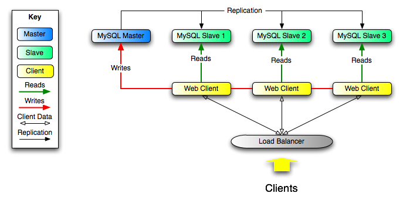

# 翻译模板

## 一、标题
下面先说明一些标题

---

### **示例：每章标题**

# 第六章 复制

### **代码：**

    # 第六章 复制

### **说明：**
> **注释：**
> 
> 每章标题使用一级标题。并且标题和`#`号之间有一个空格。

---
---

### **示例：每章第二级标题（每章标题算是一级标题）**

## 6.1 复制配置

### **代码：**

    ## 6.1 复制配置    

### **说明：**

> **注释：**
> 
> 每章的二级标题使用二级标题，即两个`#`。`#`后依然有一个空格。

---
---

### **示例：每章第三级标题（每章标题算是一级标题）**

### 6.1.1 如何启动复制？

### **代码：**

    ### 6.1.1 如何启动复制？

### **说明：**

> **注释：**
> 
> 每章的三级标题使用三级标题，即三个`#`。`#`后有一个空格。

---
---

### **示例：每章第四级标题（每章标题算是一级标题）**

#### [6.1.1.1 复制的主节点的配置](#6.1.1.1)

### **代码：**

    格式：
    [第四级标题序号 第四级标题](#第四级标题序号)
    
    示例：
    #### [6.1.1.1 复制的主节点的配置](#6.1.1.1)

### **说明：**

> **注释：**
> 
> 1. 每章的四级标题使用四级标题，即四个`#`。`#`后有一个空格。
> 2. 第四级标题涉及到锚点。所以，需要特殊处理一下。

---
---

## 二、表格

目前Markdown对表格的支持不是很好。虽然Github上有扩展，但是对复杂表格还是有点无能为力。

Markdown也支持原生的HTML标签。所以，表格使用原生的HTML标签来表示表格。

> **友情提醒**
> 可以去官网，把原来HTML表格的标签直接复制下来。

---
---

## 三、链接
如果是本文档内的链接，统一使用“参考式链接”。如果外部链接，则使用普通链接。示例如下：

### **示例：参考式链接**
比如第一章第一页有如下内容：

For a discussion of MySQL Database Server capabilities, see [Section 1.3.2, “The Main Features of MySQL”](#)

转换后的链接如下：

For a discussion of MySQL Database Server capabilities, see [Section 1.3.2, “The Main Features of MySQL”][1.3.2]

[1.3.2]: ./docs/Chapter_01/1.3.2_The_Main_Features_of_MySQL.md


### **代码：**

	For a discussion of MySQL Database Server capabilities, see [Section 1.3.2, “The Main Features of MySQL”][1.3.2]
	
	[1.3.2]: ./docs/Chapter_01/1.3.2_The_Main_Features_of_MySQL.md  //注释：如果是在翻译文档中，不需要引用`docs`这级目录。

### **说明：**

> **注释：**
> 
> 1. 详细说明，请看：[Markdown语法说明](http://wowubuntu.com/markdown/index.html#link)
> 2. “链接ID”（不明白请看上面的“语法说明”）以章节号来命名；
> 3. 链接全部放到文件末尾，上面以“链接ID”来引用，方便检查和后续修改；
> 4. 根据下面的“文件命名”和“章节命名”方法，先自己确定链接，等相应章节完成后，检查链接是否正确；
> 5. **涉及到第四级标题的链接，请使用链接到第三级标题的URL后面+`#`+<第四级标题序号>，例如：`../Chapter_16/16.2.1_Replication_Implementation_Details.md#16.2.2.1`**

---
---

### **示例：行内式链接**
再如第一章第一页出现如下内容：
> The MySQL software is Dual Licensed. Users can choose to use the MySQL software as an Open Source product under the terms of the GNU General Public License (http://www.fsf.org/licenses/) or can purchase a standard commercial license from Oracle

则这里的链接统一使用行内式链接。如下：
> The MySQL software is Dual Licensed. Users can choose to use the MySQL software as an Open Source product under the terms of [the GNU General Public License](http://www.fsf.org/licenses/) or can purchase a standard commercial license from Oracle

### **代码：**

    The MySQL software is Dual Licensed. Users can choose to use the MySQL software as an Open Source product under the terms of [the GNU General Public License](http://www.fsf.org/licenses/) or can purchase a standard commercial license from Oracle

### **说明：**

> **注释：**
> 
> 1. 外部链接统一使用这种行内式链接；

---
---


## 四、文件命名
目前考虑每第三级标题命名为一个文件。这里以`16.2.1. Replication Implementation Details`举例。

### **示例：文件命名**

16.2.1\_Replication\_Implementation_Details.md  // 因为下划线包括的字符在Markdown中表示斜体。所以，Markdown源文件中使用了`\`来转义。显示时不会看到`\`。

### **代码：**

    16.2.1_Replication_Implementation_Details.md

### **说明：**

> **注释：**
> 
> 1. 标题号数字之间使用`.`号连接，其他中间以下划线连接的；如果遇到是两个单词+连接线组成，则保持原来的连接线不变，例如`Third-Party`，保持不变；
> 2. 如果部分章节二三级标题超过了十个，可以在第1到第9节前面加0，方便排序。例如，`20.1. The INFORMATION_SCHEMA CHARACTER_SETS Table`，可以命名为`20.01_The_INFORMATION_SCHEMA CHARACTER_SETS_Table.md`。但是，文档里面书写的时候没有必要加0。
> 3. 每个第二级标题也独立命名为一个文件，为了方便查看，后面再加`.0`。例如，`16.2. Replication Implementation`，命名为`16.2.0_Replication_Implementation.md`，这样就可以排到`16.2.1_Replication_Implementation_Details.md`之前；
> 4. 文件命名使用原英文标题，并且保持原大小写不变；
> 5. 有特殊符号，不能用于文件命名时，只需将特殊符号删除即可；

---
---

## 五、目录命名
目录目前计划使用`Chapter_16`形式命名，即单词`Chapter`加两位数表示的章节号，中间使用下划线链接。例如，第十六章，即命名为`Chapter_16`。不再加目录标题。

---
---

## 六、图片命名及链接
我们说明一下图片的命名，以及如何在文档中应用图片。下面以第十六章，16.3.3节中的图片`Figure 16.1. Using Replication to Improve Performance During Scale-Out`举例。

### 图片命名
图片的命名规则如下：

### **示例：图片命名**

Figure\_16.01\_Using\_Replication\_to\_Improve\_Performance\_During\_Scale-Out.png   // 因为下划线包括的字符在Markdown中表示斜体。所以，Markdown源文件中使用了`\`来转义。显示时不会看到`\`。

### **代码：**

    格式：
    Figure_两位章节数.两位图片序号_图片名称.图片后缀名
    
    示例：
    Figure_16.01_Using_Replication_to_Improve_Performance_During_Scale-Out.png

### **说明：**

> **注释：**
> 
> 1. 标题号数字之间使用`.`号连接，其他中间以下划线连接的；如果遇到是两个单词+连接线组成，则保持原来的连接线不变，例如`Third-Party`，保持不变；
> 2. 在第1章到第9章的章节号前面加0，每章图片的前九张图片，图片序号前夜加0，这样就统一成两位，方便排序。例如，`Figure 2.1. Initial screen after loading Kleopatra`，可以命名为`Figure_02.01_Initial_screen_after_loading_Kleopatra.png`。但是，文档里面书写图片标题时，没必要加0，保持原来的样式即可。
> 3. 图片命名使用原英文标题，并且保持原大小写不变；
> 4. 有特殊符号，不能用于文件命名时，只需将特殊符号删除即可；
> 5. 某些图片没有序号及标题，例如`14.2.9.2. Architecture of InnoDB and memcached Integration`中引用的图片。可以根据HTML格式的文档中引用的图片名称来命名。从HTML文档中很容易查出图片名称：`innodb_memcached2.jpg`，命名后为：`Figure_14_innodb_memcached2.jpg`，在原文件名的基础之上，前面加上`Figure_两位章节号_`即可；另外，建议将原图片文件名的中划线，换成下划线；
> 6. **所有图片放到`images`目录中**；
> 7. **所有引用的图片，直接从HTML格式的文档中拷贝过来即可，不要自己切图。**

---
---

### 图片链接
有了上面的图片命名规则。则很容易就可以写出来

### **示例：图片链接**
我们还以第十六章，16.3.3节中的图片`Figure 16.1. Using Replication to Improve Performance During Scale-Out`举例。




### **代码：**

	格式：
    
	
    示例：
	  //全部使用相对路径。在文档中不会引用到`docs`这级目录。

### **说明：**

> **注释：**
> 
> 1. 详细说明，请看：[Markdown语法说明](http://wowubuntu.com/markdown/index.html#img)
> 2. 强调一点：所有的图片，全部使用本地图片（就是放到本文档中），不能使用网络链接表示的图片；
> 3. 图片统一使用相对路径；
> 4. 由于个人疏忽，把这部分内容忘记了，感谢朱培文和章志锐等童鞋的提醒；
> 5. 文档中，还有`Important`、`Note`等图标，这个在HTML文档中没有找到，我继续想办法看看如何处理；

---
---

## 七、列表
下面是列表的示例。列表分为无序列表和有序列表，我们分别给出示例。

### **示例：无序列表**

* 第一个
* 第二个
* 第三个

### **代码：**

	* 第一个
	* 第二个
	* 第三个

### **说明：**

> **注释：**
> 
> 1. 统一以`*`开头，`*`后加一个空格；
> 2. 如无特别情况，每行中间不再添加空格，行高可以通过后期处理时再调整样式；
> 3. 某些列表项下面还会跟一段说明。这时，可以在这段说明的上一行结尾加两个空格；那么这行在输出时，和其他列表对齐；为了统一，建议在这行说明前面也加两个空格；（感谢陈兴隆的尝试，给出了这个很好的解决方案。）

---
---

### **示例：有序列表**

1. 第一个
2. 第二个
3. 第三个

### **代码：**

	1. 第一个
	2. 第二个
	3. 第三个

### **说明：**

> **注释：**
> 
> 1. 统一以`数字.`开头，`数字.`后加一个空格；
> 2. 如无特别情况，每行中间不再添加空格，行高可以通过后期处理时再调整样式；
> 3. 尽量保持数字和输出显示的数字一致；

---
---

## 八、代码
代码考虑使用Github的扩展形式，这种形式带代码高亮。

### **示例：代码**

```sql
select NAME, AGE from USERS;
```

### **代码：**

	```sql
	select NAME, AGE from USERS;
	```

### **说明：**

> **注释：**
> 
> 1. 第一行后面是语言名称，用于代码高亮显示，请务必添加；
> 2. 如果是行内的代码，则使用行内代码，详细说明，请看：[Markdown语法说明](http://wowubuntu.com/markdown/index.html#code)

---
---

## 九、补充
1. 每章开头目录，只需要翻译标题，再加上链接即可，不需要加页码；
